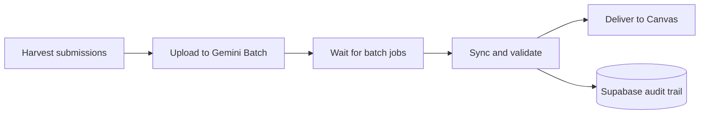

# GradeMaster-Pro

An AI-powered multi-agent grading pipeline for Canvas LMS — built to eliminate the bottleneck of manual grading at scale.

> Processes **45+ concurrent student submissions** via Gemini Batch API · **Zero manual database corrections** via two-tier Pydantic validation · **100% visual layout fidelity** via headless LibreOffice PDF microservice

*Built as a TA automation project during MS CS at George Mason University (Spring 2026)*

---

## Problem

Grading multi-section courses means hundreds of SpeedGrader clicks, repetitive feedback, and fragile copy-paste across dozens of submissions. At scale, this is a TA's biggest time sink.

GradeMaster-Pro automates the entire pipeline: **download → batch AI grading → structured audit → semi-automated delivery** — with human oversight before grades go live.

---

## Architecture



| Phase | Command | What It Does |
|-------|---------|--------------|
| Setup | `python -m src.setup_and_run` | Parse rubric, write config, start harvest |
| Harvest | `--phase harvest` | Playwright downloads submissions per section |
| Upload | `--phase upload` | DOCX→PDF, Gemini Batch JSONL, ephemeral GCS |
| Wait | `--phase wait-batches` | Poll until all section batches succeed |
| Sync | `--phase sync` | Parse per-question JSON, validate, upsert Supabase |
| Deliver | `--phase deliver` | Playwright types score + TA comment in Canvas |
| Status | `--status` | Rich dashboard of audit row counts |

---

## Key Technical Decisions

**Why LangGraph for validation?**  
Raw LLM outputs are unpredictable JSON. LangGraph state machines enforce deterministic validation with a two-tier Pydantic fallback — forcing every output into a strict schema before it touches the database. Result: zero manual corrections.

**Why Gemini Batch API over real-time?**  
Batch processing 45+ concurrent submissions costs ~75% less than synchronous API calls and eliminates rate-limiting issues. The headless LibreOffice microservice converts DOCX submissions to PDF first, preserving 100% visual layout fidelity for Gemini's multimodal reasoning.

**Why Supabase for audit?**  
Every grading decision is logged with question-level granularity — enabling TA review, dispute resolution, and grade analytics without touching the LLM again.

---

## Tech Stack

`Python 3.11+` `LangGraph` `Google Gemini Batch API` `Supabase` `Playwright` `Google Cloud Storage` `Pydantic`

---

## Quick Start

```bash
python -m venv .venv && source .venv/bin/activate
pip install -r requirements.txt
playwright install chromium

cp .env.example .env
cp config.json.example config.json

supabase start
```

See [HOW_TO_GRADE_NEW_ASSIGNMENT.md](HOW_TO_GRADE_NEW_ASSIGNMENT.md) for rubric format and full setup guide.

---

## Operational Scripts

| Script | Purpose |
|--------|---------|
| `clean_assignment.py` | Reset Supabase/GCS/Gemini/local data for one assignment |
| `completed.py` | Export grades to Excel and archive |
| `check_costs.py` | Open billing consoles + print storage metadata |
| `list_models.py` | List Gemini models with batch support |

---

## Security

- No `.env` or API keys committed — use `.env.example` as template
- `playwright_session/` (browser login state) excluded from repo
- Student submissions and solutions never committed

---

## License

MIT — see [LICENSE](LICENSE) for details.

---

<p align="center">
  Built by <a href="https://linkedin.com/in/maheshchebrolu">Mahesh Chebrolu</a> ·
  <a href="mailto:mahesh.chebrolu.dev@gmail.com">mahesh.chebrolu.dev@gmail.com</a>
</p>
